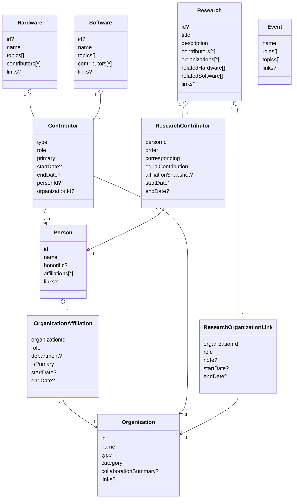

# Content Collections Review

This document captures the current pain points within `src/content.config.ts` and proposes a path to streamline the collection schemas. The emphasis is on backing the single source of truth for relationships between people, organizations, and other entities while reducing redundant metadata that has to be maintained in multiple places.

## Key Findings

- **People ↔ Organizations duplication**  
  - `people.affiliations[].partnerId` (src/content.config.ts:33) still references the removed partners collection and duplicates relationship data that also appears in `organizations.keyContacts` (src/content.config.ts:91).  
  - Both collections track similar metadata (`role`, `startDate`, `endDate`, `current`), creating two upkeep surfaces that can drift.

- **Organization collaboration metadata overlaps other collections**  
  - `organizations.collaboration` (src/content.config.ts:102) stores project and time-span data that already exists, or should exist, in collections such as hardware, software, and research via their `contributors`/`leadOrganization`/`affiliatedOrganizations` fields.  
  - The `areas` field further overlaps with the tag-like data (`researchAreas`, `topics`, etc.) captured elsewhere.

- **Hardware/software organization relationships are tracked twice**  
  - Both collections expose a generalized `contributors` array that already accepts `type: "organization"` (hardware: src/content.config.ts:235, software: src/content.config.ts:310).  
  - The additional `leadOrganization` and `supportingOrganizations` fields (hardware: src/content.config.ts:249, software: src/content.config.ts:324) require redundant updates to reflect the same partnerships.

- **Research organizations split across parallel arrays**  
  - `research.affiliatedOrganizations` and `research.fundingOrganizations` (src/content.config.ts:374) separate roles that could instead be expressed through a single structured relationship with role metadata.  
  - This pattern fragments validation and makes it easy to list the same organization twice without clarity on precedence.

- **Legacy partner identifiers linger**  
  - Hardware, software, and research collections continue to mention "partner" in their relationship fields (`leadOrganization`, `supportingOrganizations`, `affiliatedOrganizations`, `fundingOrganizations`) even though the authoritative collection is now `organizations`.  
  - These references prevent automated validation or type branding from ensuring the correct IDs are used.

- **Relationship direction is inconsistent**  
  - Some associations point from the child to the organization (`hardware.supportingOrganizations`), while others point back (`organizations.keyContacts`).  
  - Double-entry makes it unclear which field is authoritative and complicates content migrations.

## Proposed Schema Adjustments

1. **Normalize affiliations to the people collection**
   - Rename `people.affiliations[].partnerId` → `organizationId`.  
   - Drop `organizations.keyContacts`; derive “key contacts” on demand by filtering people with `current === true` and an appropriate role tag.  
   - Provide a helper or query utility to fetch current contacts for an organization to preserve the UX.
   - RESPONSE: A common thing in the UI (e.g. organization-specific page/slug) would be to list the people in that organization. We don't need to distinguish between keyContacts and just people that have that affiliation. We will just need to have a way to query the people that have that matching affiliation from individual organization pages (see data query functions in /data)

2. **Remove `organizations.collaboration`**
   - Rely on cross-references from hardware/software/research to describe engagements.  
   - If long-form collaboration narratives are needed, add a simple `collaborationSummary?: string` text field rather than structured duplication.

3. **Consolidate hardware/software organization metadata under `contributors`**
   - Remove `leadOrganization`/`supportingOrganizations` and rely on `contributors` entries tagged with roles such as `"Lead Organization"` or `"Supporting Organization"`.  
   - Add an optional `primary` flag or constrained role enum inside `contributors` if the UI needs to distinguish lead/support without a free-form string.  
   - Update comments to reference the organizations collection rather than partners.

4. **Unify research organization relationships**
   - Replace `affiliatedOrganizations`/`fundingOrganizations` with a single array of objects capturing `organizationId` and `role` (e.g., `"affiliated"`, `"funding"`, `"partner"`).  
   - This allows new roles to be introduced without expanding the schema and reduces the risk of duplicated organization IDs.

5. **Standardize organization references across collections**
   - Update field comments and eventual content to reference `organizationId`.  
   - Consider replacing bare string arrays (where they remain) with an explicit `organizationId` schema (e.g., `z.string().brand<"OrganizationId">()` or a shared Zod schema) to catch typos early.

6. **Document relationship direction**
   - Establish the convention that child entities (people, hardware, software, research, events) own their outward references.  
   - Avoid back-references on the organization documents unless they express intrinsic organization-only data (e.g., primary contact email, HQ location).

## Proposal Snapshot (src/content.config.proposal.ts)

- **People**
  - `displayName`, `visibility`, and `lastUpdated` removed in favor of leaner frontmatter.
  - Added optional `honorific` and standardized `links` object (shared schema across all collections).
  - Affiliations now use `organizationId` and share temporal metadata (start/end dates) without a `current` flag.
  - When `displayName` is used in existing person documents to specify an honorific, the displayName should be removed and the honorific should be placed in that field. In the rendering of cards and pages, the honorific should be added to the displayed name, but should not be used in things like avatars to determine the initials. 

- **Organizations**
  - Dropped `contact` and `keyContacts`; rely on normalized relationships from people and project collections.
  - Added optional `collaborationSummary` text and reused shared `links` schema for all contact info.

- **Hardware & Software**
  - Organization relationships flow exclusively through `contributors` (with person/organization discriminators).
  - Shared `links` schema replaces collection-specific link groupings.
  - Hardware collapses `applications`/`researchAreas` into a single `topics` array and removes pricing/tags.
  - Software likewise standardizes on `topics` and removes `tags`/`lastUpdate`.

- **Research**
  - `abstract` renamed to `description`; `authors` renamed to `contributors` but retains ordering/role flags.
  - Organization associations consolidated into a single structured array with roles.
  - Related hardware/software arrays now validated against dedicated ID schemas.

- **Events**
  - Simplified schema with core scheduling/location metadata and optional shared links.
  - `format`, `registrationDeadline`, and `capacity` removed; `topics` captures thematic metadata.

## Relationship Overview

## Migration Notes

- Replace `partnerId` with `organizationId` in people affiliations, remove `displayName`/`visibility`/`lastUpdated`, and drop organization-side `keyContacts`/`collaboration`.  
- Convert hardware/software `leadOrganization`/`supportingOrganizations` into `contributors` entries (use `role` to distinguish lead/support).  
- Update research frontmatter: rename `abstract`→`description`, `authors`→`contributors`, and collapse `affiliatedOrganizations`/`fundingOrganizations` into the structured `organizations` array.  
- Adjust all collections to use the shared `links` object and drop legacy link fields (`email`, `website`, `googleScholar`, etc.) from the top level.  
- Hardware/software entries should replace `applications`/`researchAreas` with `topics`, remove pricing, and drop tag arrays; ensure related projects reference actual organization/person IDs.  
- Events frontmatter should remove `format`, `registrationDeadline`, and `capacity`, and rely on `topics` plus the shared `links` object.  
- Review rendering/query utilities to consume the normalized schemas (e.g., build helpers to derive organization contacts from people affiliations).  
- Add validations or build-time checks ensuring referenced IDs exist in their target collections (hardware/software IDs now validated via shared schemas).

## Migration Progress (In Flight)

- **Schema adoption**  
  - Replaced the live `content.config.ts` with the proposal schema; removed the staging file.  
  - Synced generated Astro content artifacts to satisfy schema changes (`.astro/collections/*`, `.astro/data-store.json`).

- **People & organizations**  
  - Updated every person entry to the new shape (`honorific`, `links`, `organizationId`, temporal affiliations).  
  - Migrated organization markdown to rely on `links`/`collaborationSummary`; removed `contact`, `keyContacts`, and structured collaboration blocks.  
  - Rebuilt partner data helpers/component usage to derive contacts from `getPeopleByOrganization` and to surface `collaborationSummary`.

- **Hardware & software**  
  - Converted hardware/software frontmatter to use `contributors`, `topics`, and shared `links`; added typed `id` fields.  
  - Refactored data-layer helpers (`src/data/hardware.ts`, `src/data/software.ts`) and slug pages to consume contributors/topics instead of legacy lead/support arrays, pricing, tags, and useCases.  
  - Reworked UI metadata (badges, chip rows, related cards) so pages render correctly with the new fields.

- **Research**  
  - Migrated research content to `description`, `contributors`, `organizations`, and typed cross-references.  
  - Replaced the research data helper with a new implementation exposing topic-based filters, organization associations, and related-content lookups.  
  - Updated the research detail page to use the new structures (contributors, organizations, topics) and simplified metadata logic.

- **Events**  
  - Removed deprecated fields (`format`, `registrationDeadline`, `capacity`, `tags`) across event entries and data helpers; normalized to `topics` + shared `links`.  
  - Adjusted event search/related event logic to operate on the new field set and country/city metadata.

- **Cards & shared UI**  
  - Refreshed `PersonCard`, `ResearchCard`, `ItemCard`, and popover components to accept the new data contracts.  
  - Ensured link rendering honors the unified `links` schema (email, phone, scheduling, social profiles).

- **Projects & partner pages**  
  - Reworked the projects page to use the new data helpers so hardware/software/research sections hydrate correctly.  
  - Updated partner detail pages to compute related content via contributors, surface people automatically, and display collaboration summaries.

**Outstanding Follow-Up**
- Update remaining event markdown to remove `displayName` where redundant and ensure all `links.website` values exist.  
- Address TypeScript lint hints (unused variables) now that the major structural errors are resolved.  
- Revisit research listings/cards to expose organization roles (lead/funding/affiliated) once additional design requirements land.

## Next Steps

1. Update `src/content.config.ts` with the schema changes above.  
2. Write a migration script or manual checklist for updating markdown frontmatter.  
3. Adjust consuming components/queries to match the new conventions and remove assumptions about the dropped fields.

## Data & UI Migration Plan

### 1. People
- **Schema changes**: `displayName`, `visibility`, `lastUpdated`, `orcid`, `googleScholar`, `email` removed; new optional `honorific`; `links` object holds all contact URLs/handles; affiliations now use `organizationId` plus `isPrimary` + temporal metadata.
- **Data helpers (`src/data/people.ts`)**  
  - `getAllPeople` / `getPerson`: remove visibility filtering, rely only on `draft`; adjust types to read `links.email` instead of `data.email`.  
  - `getPeopleByOrganization`: replace `aff.partnerId` + `aff.current` with `aff.organizationId` and check `!aff.endDate`.  
  - `getPersonWithAffiliations`: dereference `organizationId`; drop `current` logic.  
  - Statistics helpers: replace `withOrcid`/`withGoogleScholar` counters with `links?.orcid` / `links?.googleScholar`.  
  - `searchPeople`: remove references to `displayName`, use `honorific` or `links`.  
  - `getRelatedPeople`: update affiliation checks to look at `!endDate` (or `endDate > now`).  
- **Pages/components**  
  - `src/pages/people/[...slug].astro`, `PersonCard`, `PersonPopover` must pull contact info from `links` and use `honorific`. Update action builders to check `links.email` etc.  
  - Where `displayName` used, fall back to `honorific + name` or `name`.  
  - Any filters based on visibility should be removed or replaced with role-based filtering if needed.
- **Content**  
  - Update each `src/content/people/*.mdx`: remove deprecated fields, move contact info under `links`, ensure affiliations reference `organizationId`, add `startDate/endDate` if available.

### 2. Organizations / Partners
- **Schema changes**: `contact`, `keyContacts`, `collaboration` removed; `links` object introduced; `collaborationSummary` optional text; `order`, `isPartner`, `location` unchanged.  
- **Data helpers (`src/data/partners.ts`)**  
  - Remove all logic tied to `collaboration.*` (active, projects, areas, start/end dates). Replace ordering/filters with organization-level flags (`featured`, `order`).  
  - Queries like `getActivePartners`, `getPartnersByProject`, `getPartnersByCollaborationArea`, `getNewestPartnerships`, etc., either drop or reimplement using downstream references (e.g., derive participation from hardware/software/research `contributors`).  
  - Revisit statistics to avoid referencing `collaboration`.  
- **Components/pages**  
  - `src/pages/partners/[...slug].astro` currently displays collaboration details and pulls related hardware/software via lead/support arrays; migrate to use `contributors` data instead and remove collaboration timeline UI or replace with derived narrative from `collaborationSummary`.  
  - Anywhere `contact.email` or `socialMedia.*` used should switch to `links`.  
- **Content**  
  - Update each organization file: remove `contact`, `keyContacts`, `collaboration`; add `collaborationSummary` if desired; convert social/contact fields into `links`.  
  - Ensure IDs referenced by people/hardware/software align.

### 3. Hardware
- **Schema changes**: remove `applications`, `researchAreas`, `tags`, `pricing`, `leadOrganization`, `supportingOrganizations`; introduce `topics`; `contributors` now sole relationship hub; optional `id` uses `hardwareIdSchema`.  
- **Data helpers (`src/data/hardware.ts`)**  
  - Replace tag/res-area logic with `topics`. Update search and related scoring to use `topics` + `contributors`.  
  - Remove `getUniqueHardwareTags`, `getHardwareByResearchArea`, etc., or rework to use `topics` / `contributors`.  
  - Organization-based filters should inspect `contributors` for `type === "organization"` and role matching (e.g., `lead-organization`).  
  - Update counts/statistics to drop tag-based metrics; consider new aggregations (by contributor role?).  
- **Pages/components**  
  - `src/pages/hardware/[...slug].astro` needs to derive lead/support orgs by filtering `contributors` roles; adjust UI for pricing removal; replace research areas/applications lists with `topics`.  
  - Detail components (`SpecificationsList`, `PricingInfo`) may become obsolete or need conditional rendering.  
- **Content**  
  - Modify each hardware entry: move all tags/applications/researchAreas into `topics`; convert lead/support orgs into `contributors` objects with roles (`lead-organization`, `supporting-organization`); move pricing info into body copy or structured data if needed. Provide contributor date ranges when available.

### 4. Software
- **Schema changes**: remove `tags`, `useCases`, `leadOrganization`, `supportingOrganizations`, `lastUpdate`; consolidate to `topics`; rely on `contributors`; optional `id` uses `softwareIdSchema`.  
- **Data helpers (`src/data/software.ts`)**  
  - Update filters and search to use `topics` instead of tags/useCases; `getRecentlyUpdatedSoftware` must switch to `publishDate` or contributor info.  
  - Organization queries must inspect `contributors` for organizational roles.  
  - Remove functions that depend on removed fields (`getUniqueSoftwareTags`, `getSoftwareCountByLanguage` may stay, but adjust to not rely on tags).  
- **Pages/components**  
  - `src/pages/software/[...slug].astro` should assemble lead/support lists from `contributors` and remove `lastUpdate` references.  
  - Any UI referencing tags/use cases must update to `topics`.  
- **Content**  
  - For each software entry: move `tags`/`useCases` -> `topics`, `lead/support` -> `contributors`, drop `lastUpdate` unless repurposed as `publishDate`.  
  - Ensure `links` map includes necessary URLs (GitHub, docs, etc.).

### 5. Research
- **Schema changes**: `abstract` → `description`; `authors` → `contributors` (still per-person with order metadata); `keywords`/`researchArea` replaced by `topics`; `organizations` structured array with role; citations removed; `links` unified; related hardware/software reference typed ID arrays; optional `id`.  
- **Data helpers (`src/data/research.ts`)**  
  - Update all references from `authors` to `contributors`, `abstract` to `description`, `researchArea`/`keywords` to `topics`.  
  - Drop citation-based sorting; consider using `publishDate` or `contributors` count.  
  - Queries like `getResearchByResearchArea`, `getResearchByKeyword`, `getMostCitedResearch`, `getResearchCountByResearchArea`, etc., need renaming or removal. Replace with `topics`-based utilities.  
  - Functions deriving unique authors must refer to `contributors`, and names retrieved via people entries (since field is now ID only).  
  - Related hardware/software queries continue but now rely on validated ID arrays.  
- **Pages/components**  
  - Research cards/detail pages should use `description`, `topics`, and map `contributors` to people data for display order.  
  - Remove citations displays unless reintroduced elsewhere.  
- **Content**  
  - Update each research entry accordingly; ensure `contributors` includes `order`, `corresponding`, etc.; move keywords/a reas into `topics`; drop citation counts or migrate to body copy.

### 6. Events
- **Schema changes**: remove `format`, `registrationDeadline`, `capacity`, `tags`; keep `roles`, add `topics`, unify links/time fields; location retains `online` boolean.  
- **Data helpers (`src/data/events.ts`)**  
  - Remove functions relying on removed fields (`getEventsByFormat`, `getEventsWithOpenRegistration`, `getEventCountByFormat`, references to `tags`, registration deadlines).  
  - Update search/filters to operate on `topics` and `links`.  
  - Ensure date sorting uses `startDate`/`endDate` from new schema (string→Date still parsed).  
- **Pages/components**  
  - Event detail card components should stop rendering format/registration info. Replace tags chips with `topics`.  
- **Content**  
  - Remove unused fields from each event entry; populate `topics` array.  
  - Normalize link structure and ensure lat/lng optional inputs remain valid.

### 7. Shared Utilities & Config
- `src/config/linkConfig.ts` and any helper mapping link keys must align with the new unified `linksSchema`; remove per-collection special cases.  
- Update TypeScript types (`src/types.ts`, if any) to match new schema shapes.  
- Review other directories (`src/utils`, `src/components/detail`) for references to removed fields (e.g., pricing components).  
- Ensure build/test pipeline handles new optional IDs (some entries might rely on frontmatter `id`; confirm slug generation unaffected).

### 8. Content Verification & Testing
- Implement scripts or tests to validate that all referenced organization/person IDs exist post-migration.  
- Run `astro check` or content-specific tests to surface missing fields.  
- For pages relying on aggregated metrics (counts by category/type), ensure new data still satisfies UI expectations; adjust copy if necessary.

### 9. Rollout Strategy
1. Land schema updates in `content.config.ts` and adjust data helpers/components in the same change.  
2. Batch migrate content files (perhaps per collection) with automated scripts to reduce manual edits.  
3. Provide temporary compatibility layers (e.g., map old fields to new shapes) if incremental rollout needed, but plan to remove quickly to avoid confusion.  
4. After migration, run lighthouse/visual regression tests to ensure cards and detail pages render correctly with new data.  
5. Update documentation or authoring guides so content contributors understand the new frontmatter expectations.
